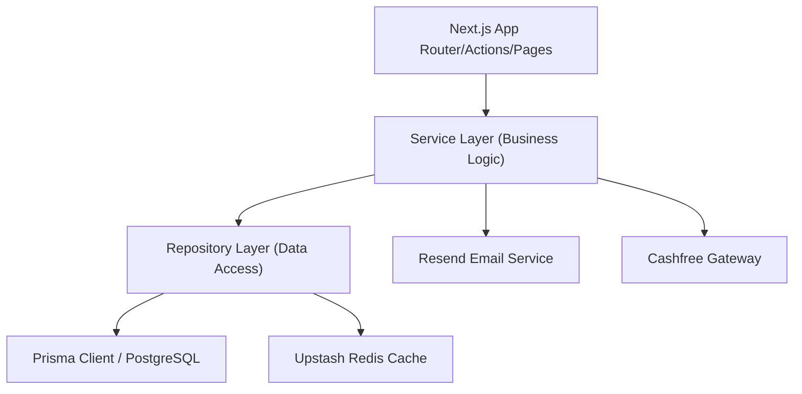

# Tripzy Enterprise Platform Foundation

Welcome to the enterprise-grade foundation of **Tripzy**, a premium, scalable, and secure Self Drive Car Rental platform built with **Next.js 15**, **React 19**, and **TypeScript**.

---

## 📐 Architecture Overview

Tripzy is built using **Feature-Based Architecture**, coupled with a strict separation of concerns via the **Service Layer** and **Repository Pattern**.

### Clean Architecture Layers



1. **Client / Server Pages (`app/`, `components/`)**: The presentation boundary. Consists of pure components, layout definitions, context loaders, and dynamic triggers.
2. **Service Layer (`services/`, `features/*/services/`)**: Enforces clean business validation constraints. Controls email communications, transaction allocations, API requests, and audit Logging.
3. **Repository Layer (`features/*/repositories/`)**: Abstracted interface isolation for querying the database or caching storage delegates.
4. **Data Access (`lib/db.ts`, `lib/redis.ts`)**: Base database adapters and client instances.

---

## 📁 Directory Structure

The project conforms to the following structural schema to ensure modules are modular and self-contained:

```text
Tripzy/
├── .github/workflows/          # Continuous Integration workflow rules
├── actions/                    # Next.js Server Actions (root scope)
├── app/                        # Next.js App Router endpoints, loaders, errors
├── components/                 # Global UI atoms (buttons, dialogs, skeletal loading)
├── config/                     # Strict environment validations and site static options
├── constants/                  # Standard HTTP tags, error tags, branding configurations
├── emails/                     # Transactional layout scripts (Resend integrations)
├── features/                   # Core modules (Self-contained domains)
│   └── [feature_name]/         # Examples: user, billing, booking, vehicle, KYC
│       ├── components/         # Feature specific elements
│       ├── hooks/              # Feature specific hooks
│       ├── services/           # Feature business layer
│       ├── repositories/       # Feature database controllers
│       ├── types.ts            # Domain specific Type declarations
│       └── validators.ts       # Domain Zod verification maps
├── hooks/                      # Shared global React hooks
├── lib/                        # Infrastructure singletons (Prisma, Redis, Resend, Sentry)
├── middleware/                 # Rate limiting, secure headers, CORS, session RBAC
├── providers/                  # Application contexts (Themes, React-Query, Toasts)
├── prisma/                     # Database setup scripts and model blueprints
├── public/                     # Static media items and assets
├── styles/                     # Tailwinds styling directives
├── tests/                      # Testing config layers and E2E frameworks
├── types/                      # Universal TS mappings
├── utils/                      # Core utility scripts (AES, CSRF, formatting)
└── validators/                 # Shared validation structures
```

---

## 🚀 Development Workflow & Commands

### Prerequisites
- Node.js version 20+ installed.
- PostgreSQL database instance configured.
- Upstash Redis account credentials.

### Installation
```bash
npm install
```

### Development server
```bash
npm run dev
```

### Code Formatting and Linting
```bash
# Verify type safety
npx tsc --noEmit

# Run ESLint validation
npm run lint

# Automatically format code using Prettier
npm run format
```

### Testing Suite
```bash
# Execute unit and integration tests (Vitest)
npm run test

# Run Watch Mode
npm run test:watch

# Execute E2E browser tests (Playwright)
npm run test:e2e
```

---

## 📝 Coding Standards & Guidelines

### Coding Rules
- **Component Limit**: Maximum component length is **250 lines**. Keep them focused and decoupled.
- **Function Limit**: Maximum function length is **50 lines**. Extract auxiliary helpers into utility files.
- **Strict Typing**: No `any` type allowed. Define explicit TypeScript interfaces and types.
- **Server Components**: Prefer Next.js React Server Components (RSC) by default. Use `"use client"` only for interactive components containing hooks or DOM actions.

### File Naming Conventions
- **React Components**: PascalCase (e.g., `Button.tsx`, `EmptyState.tsx`).
- **Hooks**: camelCase starting with `use` (e.g., `useMediaQuery.ts`).
- **Files/Utilities**: kebab-case (e.g., `security.ts`, `error-boundary.tsx`).
- **Feature Modules**: lowercase singular (e.g., `booking`, `billing`).

### Branching Strategy
We use Git Flow for release pipelines:
- `main`: Represents stable production deployments.
- `staging`: Integration environment testing.
- `dev`: Active core developmental workspace.
- `feature/[feature-name]`: Active working branches derived from `dev`.
- `hotfix/[fix-name]`: Immediate patch fixes branching directly from `main`.

### Git Commit Conventions
We use the **Angular Commit Specification**:
- `feat`: A new feature (e.g., `feat: integrate Google Maps route rendering`)
- `fix`: A bug fix (e.g., `fix: resolve CSRF validation token miss`)
- `docs`: Documentation updates (e.g., `docs: add folder structure diagram`)
- `style`: Visual adjustments, missing semi-colons, formatting checks
- `refactor`: Structural rewrite that does not change functional behavior
- `test`: Adding missing test coverage or adjusting test rules
- `chore`: Infrastructure adjustments, configuration changes, packages install
