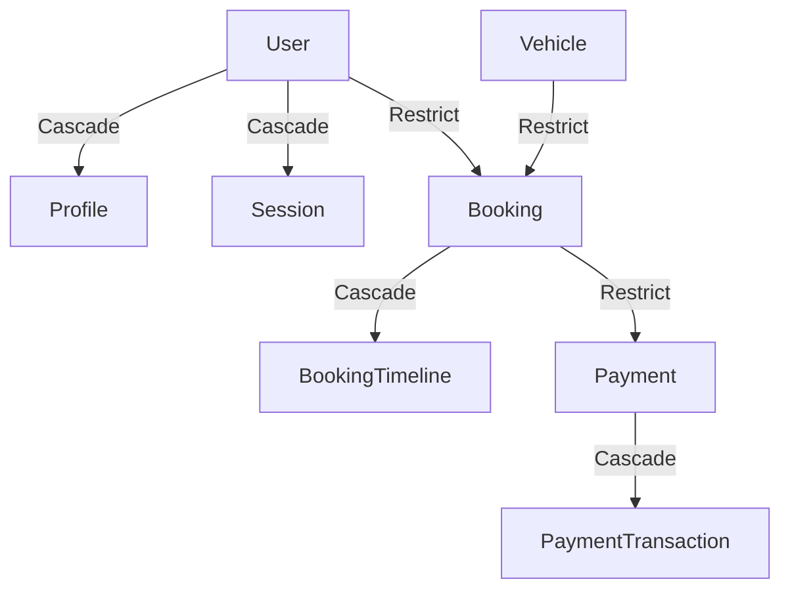

# Tripzy Database Entity-Relationship & Schema Architecture

This document describes the design decisions, relation structures, and key mappings implemented within the Tripzy PostgreSQL database schema.

---

## 🏛️ Relationship Design Patterns

### 1. One-to-One Relationships (1:1)

- **User ↔ Profile**: A user account maps to exactly one personal profile containing metadata (first name, last name, avatar).
- **User ↔ DrivingLicence**: A user is associated with a single verified driving licence vector to enforce KYC constraints.
- **User ↔ Wallet**: A customer is associated with exactly one digital balance wallet for cancellations and credit holds.
- **User ↔ RiskProfile**: A customer is associated with exactly one risk profile holding security ratings and verification attempts.
- **Prisma implementation**: Defined using a unique index constraints on the foreign key field (`userId String @unique`).

### 2. One-to-Many Relationships (1:N)

- **City ↔ PickupLocation**: A city houses multiple pickup and drop spots.
- **Vehicle ↔ VehicleImage**: A vehicle is associated with multiple sorted images.
- **User ↔ Booking**: A customer initiates multiple booking records over time.
- **Booking ↔ BookingTimeline**: A booking logs progress steps as a sequence of events.

#### Advanced Operational Relationships

- **Vehicle ↔ GpsTrackerRecord & VehicleTelematics**: High-frequency IoT logging streams (lat/lng, speed, tire pressure, error logs).
- **Vehicle ↔ VehicleInspectionChecklist & CleaningLog**: Standard operations workflows checking cleaning states and mechanical safety parameters.
- **User ↔ UserSubscription**: Subscriptions associating users with plan features.
- **User ↔ SavedPickupLocation**: Customer-defined default pickup addresses.
- **User ↔ FraudFlag**: Active indicators detailing suspected account activities.
- **VehicleDamageReport ↔ AiDamageDetectionResult**: AI visual analysis logs detailing dent sizes and confidence levels on vehicle return.
- **VehiclePricing ↔ AiPricingRecommendation**: AI model recommendations suggesting daily rates based on regional demand multipliers.

### 3. Many-to-Many Relationships (M:N)

To optimize index scans and scale query limits, we use explicit, normalized joint tables for many-to-many relationships instead of implicit arrays:

- **Role ↔ Permission** (via `RolePermission` join table): Connects access flags to standard system roles.
- **User ↔ Role** (via `UserRole` join table): Supports multiple roles per user.
- **Vehicle ↔ VehicleFeature** (via `VehicleFeaturesOnVehicles` join table): Maps amenities (GPS, Bluetooth, Leather Seats) to active vehicles.

---

## 🔒 Cascading & Restricting Rules

To maintain high data integrity and prevent the accidental deletion of historical invoices or audit records, we apply strict cascading constraints:

- **Cascade Delete (`onDelete: Cascade`)**:
  - Automatically cleans up transient operational records.
  - Examples: `User` -> `Session`, `KycRequest` -> `KycVerificationLog`, `Booking` -> `BookingTimeline`.
- **Restrict Delete (`onDelete: Restrict`)**:
  - Blocks deletion if children records exist.
  - Examples: `User` -> `Booking`, `Vehicle` -> `Booking`. (We cannot delete a user or vehicle that has active bookings).
- **Set Null / Nullify (`onDelete: SetNull`)**:
  - Detaches the record but preserves data integrity.
  - Examples: `Booking` -> `VehicleDamageReport` (Deleting the booking detaches the damage report but preserves the damage record).

---

## 🔑 Composite Key Mappings

We use composite keys (`@@id`) to enforce uniqueness and optimize storage space for relationship tables:

- **`RolePermission`**: Primary key is a composite of `[roleId, permissionId]`.
- **`UserRole`**: Primary key is a composite of `[userId, roleId]`.
- **`VehicleFeaturesOnVehicles`**: Primary key is a composite of `[vehicleId, featureId]`.
- **`CouponUsage`**: Composite constraint on `[bookingId, couponId]` ensures a coupon is applied only once per booking.
